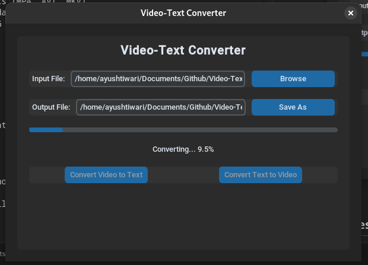

# Video-Encrypter: Video to Text Converter

A powerful tool that converts videos into text format and back again, enabling video storage and transmission through text-based channels. This project features both a command-line interface and a modern GUI for easy interaction.


## 🌟 Features

- Convert any video file to a text-based format
- Reconstruct the original video from the text
- Modern GUI interface with progress tracking
- Command-line interface for automation
- Support for various video formats (MP4, AVI, MKV)
- Progress tracking and status updates
- Efficient compression using JPEG and base58 encoding

## 🛠️ Technology Stack

- Python 3.x
- OpenCV for video processing
- CustomTkinter for modern GUI
- Base58 for text encoding
- NumPy for numerical operations
- Threading for non-blocking operations

## 📋 Prerequisites

- Python 3.x
- Tkinter (usually comes with Python, but on Linux: `sudo dnf install python3-tkinter`)
- Required Python packages (installed via pip)

## 🚀 Quick Start

1. Clone the repository:
   ```bash
   git clone git@github.com:XxAlonexX/Video-Encrypter.git
   cd Video-Encrypter
   ```

2. Install dependencies:
   ```bash
   pip install -r requirements.txt
   ```

3. Run the GUI version:
   ```bash
   python GUI.py
   ```

   Or use the command-line version:
   ```bash
   python Converter.py input_video.mp4 output.txt
   ```

## 💡 How It Works

1. **Video to Text Conversion:**
   - Reads video frames using OpenCV
   - Compresses each frame using JPEG
   - Encodes compressed frames using base58
   - Stores metadata (fps, dimensions, etc.)
   - Saves everything in a JSON structure

2. **Text to Video Conversion:**
   - Reads the JSON structure
   - Decodes base58 text back to binary
   - Reconstructs frames from binary data
   - Creates a video file with original properties

## 🎯 Use Cases

- Store videos in text-based databases
- Send videos through text-only channels
- Version control for video files
- Video archival in text format
- Educational purposes and research

## 🤝 Contributing

1. Fork the repository
2. Create a new branch
3. Make your changes
4. Submit a pull request

## ⚠️ Notes

- The text file size will be larger than the original video
- Video quality might be slightly reduced due to compression
- Processing time depends on video size and resolution
- Requires sufficient memory for large videos
